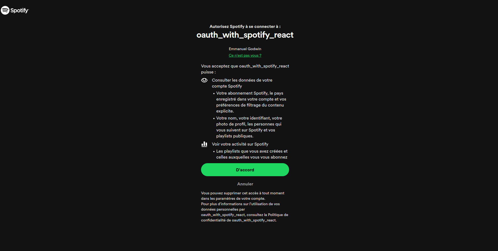

# Understanding OAuth with Spotify API (Authorization Code with PKCE Flow)

This project is a practical introduction to using OAuth with the Spotify API, utilizing the authorization code flow with
PKCE (Proof Key for Code Exchange).




## Prerequisites

Before starting, ensure you have installed:

- Node.js and npm (version 10 or higher recommended)
- Preferred text editor or IDE

## Installation

To install the necessary dependencies for the project, follow these steps in your terminal or command prompt:

1. Clone this repository on your local machine:

```bash
  git clone https://github.com/godwinmanu/oauth_with_spotify_api_and_react.git
```

2. Navigate to the project directory :

```bash
  cd spotify-oauth-project
```

3. Install the dependencies:

```bash
npm install
# or
yarn install
# or
pnpm install
# or
bun install
```

## Setting Up Environment Variables

To configure the necessary environment variables for the project, copy the `.env.sample` file located at the root of the
project and rename it to `.env`. Modify the values according to your needs. Remember not to commit the `.env` file to
the remote repository for security reasons.

After modifying the values, remember to restart the development server for the changes to take effect.

## Starting the Development Server

Once the dependencies are installed, you can start the development server by following these steps:

1. Ensure you're in the root directory of the project in your terminal or command prompt.

2. Run the following command to start the development server:

```bash
npm run dev
# or
yarn dev
# or
pnpm dev
# or
bun dev
```

Your application should now be accessible via `http://localhost:5173` (or the URL specified in your configuration).

## Conclusion

This project offers a practical introduction to OAuth authentication with the Spotify API in React, implementing the
authorization code flow with PKCE.
